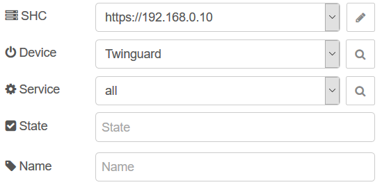
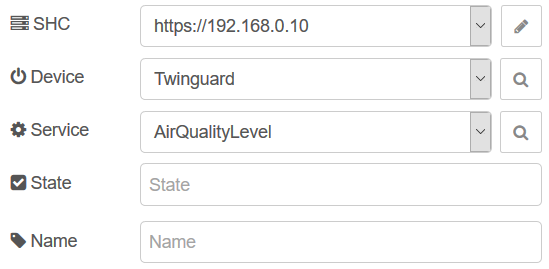
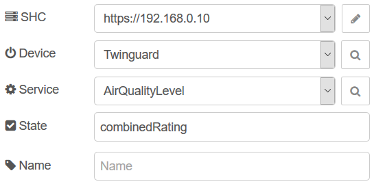

# Bosch Smart Home Controller (SHC) nodes for Node-Red

This module provides several nodes for interacting with Bosch Smart Home services and edge devices via the local controller API. A full documentation of the API can be found [here](https://apidocs.bosch-smarthome.com/local/).

**Compatible with Node-RED version 1.0.0 or higher**

### Release Note

With the update to version **0.1.7** or higher, the configuration of the SHC must be created again if you have created SHC configurations with version 0.0.6 or earlier. Therefore, please delete old SHC configurations first and recreate them after the update. 

The reason for this is a change of the certificate handling. As of version 0.1.7, the certificates are stored in Node-RED. This makes the whole thing more secure if Node-RED itself is properly secured. After the update you can delete the directory "/certs" in "~/.node-red". 

If you encounter any problem, do not hesitate to create an issue.

### Features

- Local network discovery of the SHC
- Pairing with SHC
- Event polling (long polling)
- Get all services from devices
- Get and set states of devices
- Trigger scenarios

## Device Node

To receive data from the SHC, there are two ways either via long polling or via a request. Please note that you should always prefer the long polling mechanism to receive data from the SHC rather than requesting it with a trigger. However, sometimes it is useful to request a state at a specific point in time.

### Long Polling

Events are received via **long polling** from the SHC as soon as any state of a service changes. Each device has several services. A device node sends either [all related services of a device](#get-all-services-of-a-device), [a specific service](#get-a-specific-service-of-a-device) or a [single state](#get-a-state).

### Requesting

To request a device any **msg** can be used, if the **msg.payload** does not match the values to [set a state](#set-a-state). The device node overwrites **msg.topic** and **msg.payload** with the state, service, or all services as array, as configured in the node configuration page.

### Get all services of a device

To send all related services of a device, select a **Device** and select **all** as a **Service**. The **State** input field can be left empty. The **msg.payload** contains a JSON array with all related services, if you request it. If received via long polling, a single JSON service object is sent.

### Get a specific service of a device

Select a **Service** to send only JSON objects of the specified service. Requesting the service sends an **ENTITY_NOT_FOUND** error message if the service does not exist or is not related to the device. Via long polling, no **msg** will be sent from the node.

### Get a state

To send only a value instead of the entire service object, enter the name of the **State** in the corresponding field. The **service object** is sent from the node if the state does not exist or is not related to the service.

### Set a state
If the **msg.payload** matches the predefined **type** and **range** of the **service**, the associated state will be updated with the specified payload value. The following services can be updated:

| Service                             | Payload Type | Payload Range | Information |
|-------------------------------------|--------------|---------------|-------------|
| **IntrusionDetectionControl**       | boolean      | true, false    | Activate/deactivate alarm system |
| **PresenceSimulationConfiguration** | boolean      | true, false    | Activate/deactivate presence simulation |
| **SmokeDetectorCheck**              | boolean      | true, false    | Triggers a test alarm on this device |
| **PowerSwitch**                     | boolean      | true, false    | Turn device on/off |
| **PrivacyMode**                     | boolean      | true, false    | Activate/deactivate camera privacy mode |
| **RoomClimateControl**                  | Number       | 5.0, 5.5, ..., 29.5, 30.0       | Set a room temperature |
| **ShutterControl**                  | Number       | 0.000, 0.005, ..., 0.995, 1.000 | Set the level of a shutter |

## Scenario Node

Use this node to trigger the scenario defined in this node. Each **msg** can be used as a trigger.

## Faults Node

This node sends all events containing the **faults**-key. These messages usually refer to low-battery events of battery-powered edge devices.

By activating the **Debug** check box, this node sends all messages that are received from the SHC via long polling. 
